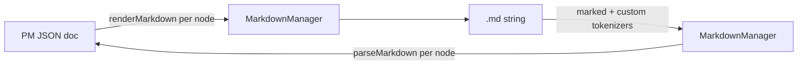

# Markdown Import/Export — Design Brief

Accepted design for exporting a document to `.md` and importing `.md` back. Fulfils the
`serializeMarkdown`/`parseMarkdown` surface reserved in [`design-brief.md`](design-brief.md).

## Foundation

ProseMirror JSON stays the canonical format (see the deferred-decisions table in
[`milestones.md`](milestones.md)). Markdown is an interchange format: users save and load `.md`
files that read well on GitHub and Obsidian, and every slash-editor node survives the round trip.

**Goals**

- `editor.getMarkdown()` and `setContent(md, { contentType: "markdown" })` when a kit opts in.
- Pure, DOM-free `serializeMarkdown` / `parseMarkdown` usable on a server and in core's Node tests.
- GitHub-flavoured output; anything GFM cannot express carries its identity in `<!-- slash:… -->`
  comments, which GitHub and Obsidian hide when rendering.

**Non-goals:** a playground or registry UI, markdown paste handling, exporting comment threads.



**Approach:** Tiptap's official `@tiptap/markdown` (`MarkdownManager` over `marked`). Each node owns
its `renderMarkdown` / `parseMarkdown` / `markdownTokenizer` in its own file — the same hooks
StarterKit, list, table, and link already ship — so new first- or third-party nodes (via `extend`)
bring their own rules and nothing central grows. Rejected: a hand-rolled central registry over
`prosemirror-markdown` (a second convention beside Tiptap's hooks) and an HTML detour through
turndown (needs a DOM, lossy double conversion).

## Technical details

### Interfaces

```ts
// @slash-editor/core/markdown — separate entry; the only module importing @tiptap/markdown
function markdown(options?: Partial<MarkdownOptions>): Extension; // createBlockKit({ extend: [markdown()] })
function serializeMarkdown(doc: JSONContent, extensions?: Extensions): string; // default createBlockKit()
function parseMarkdown(markdown: string, extensions?: Extensions): JSONContent;

// @slash-editor/core — node config field, read by the markdown entry
interface NodeConfig {
  excludeFromMarkdown?: (node: JSONContent) => boolean;
}
```

`extensions` is optional rather than absent because the schema is configurable; the default keeps
the brief's one-argument call shape.

Opt-in was first a `createBlockKit({ markdown })` option. Measured, that pulled `marked` +
`@tiptap/markdown` (~63 KB minified, ~20 KB gzipped) into every kit bundle, since the kit
references them unconditionally — so the extension moved to the subpath and is opted into through
`extend`. Nodes keep their markdown hooks in the main entry via the dependency-free
`markdown-syntax.ts`.

### Marker grammar

`<!-- slash:<type> <JSON> -->` on its own line directly before the block it annotates. `--` in the
JSON payload is written `\u002d\u002d`, so no attribute value can terminate the comment. Structural
markers carry no payload.

### Mapping

| Node                                             | Markdown                                                                                                                                    |
| ------------------------------------------------ | ------------------------------------------------------------------------------------------------------------------------------------------- |
| callout                                          | GitHub alert `> [!TIP]`. Icons 💡 TIP, ℹ️ NOTE, ❗ IMPORTANT, ⚠️ WARNING, ⛔ CAUTION; any other icon adds a `slash:callout {"icon"}` marker |
| toggle (`details`)                               | `<details open?>` / `<summary>Title</summary>` (level n → `<summary><hn>Title</hn></summary>`) / blank line / body / `</details>`           |
| columns                                          | `<!-- slash:columns -->` column 1 `<!-- slash:column -->` column 2 … `<!-- /slash:columns -->`                                              |
| image                                            | ``; a `slash:image {"width"}` marker only when a width is set                                                                    |
| file / video / embed                             | `slash:file {size,mime}` / `slash:video {poster}` / `slash:embed {mode,description,thumbnail}` marker, then `[name/src/title](src)`         |
| mention                                          | `<!-- slash:mention {"id","label"} -->@label<!-- /slash:mention -->` (closing marker bounds labels with spaces)                             |
| comment mark, `aiBlock`, uploading/errored media | Dropped (`excludeFromMarkdown`, so no blank-line residue)                                                                                   |

### Edge cases

- Raw HTML parses to literal text without a DOM (`MarkdownManager.parseHTMLToken`), so `<details>`
  and every marker are recognized by custom `marked` tokenizers, never by the HTML fallback.
- A marker whose JSON is malformed, or that no node claims, is swallowed by a catch-all tokenizer;
  the block after it parses as plain markdown. Import never throws on user input.
- An unclosed `<details>` or columns marker makes its tokenizer decline; the text falls back to
  literal content. Lines inside fenced code never count towards nesting.
- An image inside running text (a README badge) keeps its alt text only: the schema's `image` is a
  block, and a link mark would collide with a wrapping link's.
- Every manager gets its own `Marked` instance: the upstream default registers tokenizers into the
  global `marked`, stacking a copy per editor and changing how a host app's own `marked` parses.
- Block ids are never exported; import relies on `BlockId` assigning fresh ones.
- `setContent` on a collaborative document replaces it for every peer — documented, not guarded.

### Risks (as resolved)

1. `MarkdownManager` flattens and priority-sorts extensions itself — no helper needed.
2. `marked` tries extension tokenizers before built-ins, most recently registered first; the
   catch-alls carry a high priority so they register first and are tried last.
3. Not tree-shaken from a kit option — moved to `@slash-editor/core/markdown` (see Interfaces).
4. A node with no `renderMarkdown` renders as nothing — documented as a requirement for `extend`
   nodes.
5. `@label` can ping real users when viewed on GitHub; GitHub does not render markdown inside
   `<summary>`, so an inline-formatted toggle title shows its escapes there. Accepted.
6. Upstream serialization moves whitespace out of inline code and bold (`` `# ` `` → `` `#` ``);
   not specific to this work.

## Delivery

- Core Vitest (Node, no DOM): `parse(serialize(doc))` equals `doc` (ids ignored) per custom node;
  golden strings only where the text is the contract (alert syntax, `<details>`, marker grammar);
  malformed and unclosed marker fallbacks; a toggle inside a callout inside a column; `-->` inside
  an attribute value.
- Throwaway script round-trips the playground's seed content: every custom node survives; only
  upstream inline-code whitespace (risk 6) differs.
- Docs: `codebase/package-apis.md`, `architecture/editor-runtime.md`, a site guide page, a milestone
  entry.
- Minor version bump; a new entry point, so existing kits are unchanged.
