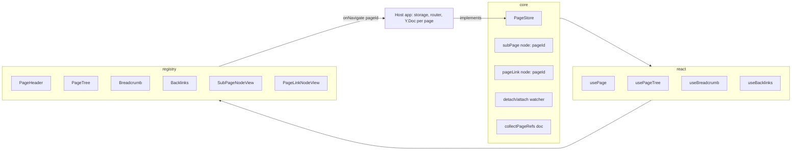

# Pages — Design Brief

Status: accepted (brainstorm output) · Date: 2026-10-04

Decisions confirmed in review: full scope (sub-page block, page links, page header, tree +
breadcrumb, backlinks); library API + registry UI, not an app; navigation through a host
callback; title is page metadata owned by the host; one `Y.Doc` per page; sub-page deletion is
reported to the host, never acted on; inline page links share the `@` menu with mentions.

## 1. Foundation

### Problem

Notion's "page" is two things: an editor surface (sub-page blocks, links between pages, a
title/icon/cover header) and an application (storage, a page tree, routing, permissions).
slash-editor can own the first and must not own the second — hosted services are a non-goal
([`product-goals.md`](product-goals.md)). The repo already has the right split for this:
`UploadAdapter`, `StreamAdapter` and `CommentThreadStore` all anchor in core while the body
lives with the host.

### Goals

- `subPage` block: `/page` calls `store.create({ parentId })`, inserts the block, and
  navigates into the new page. Clicking or pressing Enter on it calls `onNavigate(pageId)`.
- `pageLink` inline node, inserted from the shared `@` menu or `/link to page`. Titles always
  render live from the store, so a rename shows everywhere at once.
- Page header (icon, cover, title) editing host-owned metadata, outside the document.
- Page tree, breadcrumb and backlinks as editor-independent React hooks plus registry
  components.
- Detaching or re-attaching a sub-page block (delete, undo, cut/paste) is reported to the host,
  which decides about trash and restore.

### Non-goals

- Persistence, permissions, Notion databases/views.
- Drag-and-drop in the page tree; moving a page between parents from the UI.
- Cross-page full-text search.
- Routing inside the library.

### Architecture



Flows:

1. **Create** — `/page` → `store.create({ parentId: currentPageId })` → insert
   `subPage{pageId}` → `onNavigate(pageId)`.
2. **Render** — node views read `store.peek(pageId)` (a synchronous cache) and re-render on
   `store.subscribe`; a cache miss triggers `store.load(pageId)`.
3. **Detach** — a plugin diffs `subPage.pageId` sets across local transactions and calls
   `onSubPagesDetached(ids)` / `onSubPagesAttached(ids)`.
4. **Collaboration** — one `Y.Doc` per page, provider created by the host per `pageId`; tree and
   title changes reach other clients through `store.subscribe`.

Constraints honored: core stays renderer-free; node attributes are only `pageId`, assigned once
at insert; opt-in through `createBlockKit({ pages })` like `mention`/`comment`; no new package —
nothing here carries a heavy dependency, so the `@slash-editor/core/markdown` subpath argument
does not apply.

## 2. Technical Details

### Contract (`packages/core/src/pages.ts`)

```ts
interface PageMeta {
  id: string;
  parentId: string | null;
  title: string;
  icon?: string;
  cover?: string;
  trashed?: boolean;
}

interface PageStore {
  create(input: { parentId: string | null; title?: string }): PageMeta | Promise<PageMeta>;
  update(
    id: string,
    patch: Partial<Pick<PageMeta, "title" | "icon" | "cover">>,
  ): void | Promise<void>;
  /** Synchronous cache read: node views and markdown export. */
  peek(id: string): PageMeta | undefined;
  /** Fills the cache on a miss. */
  load(id: string): Promise<PageMeta | undefined>;
  /** Children in sibling order, trashed included. */
  listChildren(parentId: string | null): PageMeta[] | Promise<PageMeta[]>;
  /** Optional tree mutations; the library never calls them. */
  setTrashed?(ids: readonly string[], trashed: boolean): void | Promise<void>;
  move?(id: string, target: { parentId: string | null; index: number }): void | Promise<void>;
  search(query: string, context: { signal: AbortSignal }): PageMeta[] | Promise<PageMeta[]>;
  /** Host-owned index, fed by `collectPageRefs`. */
  backlinks?(id: string): string[] | Promise<string[]>;
  /** Notifies after local or remote changes. */
  subscribe(listener: () => void): () => void;
}

interface PagesOptions {
  store: PageStore;
  currentPageId: string | null;
  onNavigate: (pageId: string) => void;
  onSubPagesDetached?: (ids: string[]) => void;
  onSubPagesAttached?: (ids: string[]) => void;
  resolveHref?: (pageId: string) => string;
  onError?: (error: unknown, context: { editor: Editor }) => void;
}
```

### Nodes

- `subPage` — group `block`, atom, attribute `pageId` (plus `BlockId`'s `id`).
- `pageLink` — inline atom, attribute `pageId`.
- Both render `data-page-id`; core emits no class names.

### Shared `@` menu

`MentionItem` gains `kind?: "page"`. Selecting a page item inserts `pageLink` instead of
`mention`. With `pages` set, the kit wraps the mention `items` provider to merge
`store.search(query)` results; with `pages` set and `mention` absent, the kit enables mention
with a pages-only provider.

### Detach/attach watcher

- Diffs `subPage.pageId` sets inside the transaction's changed ranges (`getChangedRanges`), not
  the whole document.
- `moveBlock` is one delete + insert transaction, so the id survives and nothing fires.
- Skips remote transactions, so only the client that deleted reports it. Rule (spike-verified):
  process a transaction with no `y-sync$` meta, or one whose meta has
  `isUndoRedoOperation: true`; skip `isChangeOrigin: true` with `isUndoRedoOperation: false`.
  A local Yjs undo/redo arrives as a whole-document replace, so its changed range is the full
  document — acceptable, since it is user-paced.

### Uniqueness

A page has exactly one parent. Duplicating a `subPage`, or pasting one whose `pageId` is already
in the document or whose `store.peek(id).parentId !== currentPageId`, converts it into a
paragraph holding a `pageLink`. Cut and paste within the same page keeps the `subPage` and
reports detach then attach.

### React (editor-independent, like `usePresence`)

- `usePage(store, id)` — `useSyncExternalStore` over `peek`, `load` on a miss.
- `usePageTree(store, rootId)` — lazy expansion through `listChildren`.
- `useBreadcrumb(store, id)` — walks `parentId`.
- `useBacklinks(store, id)`.

### Registry

`SubPageNodeView`, `PageLinkNodeView`, `PageHeader` (title outside `EditorContent`;
Enter/ArrowDown moves focus to the document start, ArrowUp at the document start moves it back),
`PageTree`, `Breadcrumb`, `Backlinks`.

### Backlinks

Pure `collectPageRefs(doc) → { subPages: string[]; links: string[] }`, at any depth. The host
calls it on save to maintain its index and serves results through `store.backlinks`.

### Markdown

Export `<!-- slash:subPage {"pageId":"…"} -->[Title](href)` with the title from `peek` and the
href from `resolveHref`. Import keeps only `pageId`; the store stays the title's source of truth.

`MarkdownManager` binds `renderMarkdown` through `getExtensionField` with no context, so `this`
is only `{ parent }` — `this.options` does not exist there (spike-verified). The `pages(options)`
factory therefore builds `subPage`/`pageLink` with `.extend({ renderMarkdown })` closing over
`store`/`resolveHref`. Without the factory (bare node, no store) export falls back to the marker
plus the `pageId` as link text.

### Host requirement

Remount the editor per page (`key={pageId}`): extensions and the `Y.Doc` are latched once per
editor instance.

### Edge cases and risks

| Case                                                       | Handling                                                                                                      |
| ---------------------------------------------------------- | ------------------------------------------------------------------------------------------------------------- |
| Page not loaded, missing, or trashed                       | Node view shows a skeleton or a "missing / in trash" state; the node is never removed automatically           |
| Collaborative undo: Yjs `UndoManager` emits `y-sync$` meta | Resolved by spike: local undo/redo carries `isUndoRedoOperation: true`; peers see `false`. Watcher rule above |
| `renderMarkdown` needs `options.store`                     | Resolved by spike: `this.options` is unreachable; the factory closes over the store (Markdown section)        |
| Concurrent title edits                                     | Last-write-wins through the store — accepted consequence of title-as-metadata                                 |
| `store.create` rejects on `/page`                          | Nothing is inserted; `onError` is called, mirroring `mention`                                                 |

## 3. Delivery

### Slices

1. **Risk spike** ✅ — both risks resolved; outcomes recorded in the watcher, Markdown, and risk
   sections above.
2. **Core contract + nodes** — `pages.ts`, kit option, `/page` and `/link to page` slash items.
3. **Watcher + uniqueness** — detach/attach over changed ranges, paste/duplicate conversion,
   `create` failure.
4. **Page mentions** — `MentionItem.kind`, provider wrapping, select branching.
5. **React hooks.**
6. **Registry + playground** — node views, header, tree, breadcrumb, backlinks; `registry.json`
   and the kit; `/playground?page=<id>` on an in-memory/localStorage `PageStore`.
7. **Docs + release** — component and guide pages (writing a `PageStore`, indexing backlinks,
   one `Y.Doc` per page); `package-apis.md`, `editor-runtime.md`, `directory-structure.md`,
   testing doc, milestone; minor changeset for `core` and `react`.

### Verification

- **Unit** (`packages/core/tests/pages.test.ts`): no store → no nodes; `collectPageRefs` at any
  depth (toggle, columns, table); watcher detach on delete, attach on undo, silence on
  `moveBlock` and remote transactions; duplicate/paste conversion to `pageLink`; markdown round
  trip keeps `pageId`; a `kind: "page"` mention item inserts `pageLink`.
- **E2E** (`site/tests/e2e/pages.spec.ts`): `/page` creates and navigates with a correct
  breadcrumb; a header rename updates the parent's block and the tree; `@` page chip inserts and
  navigates; delete marks the page trashed in the mock store and undo restores it; backlinks list
  the referencing page.
- **Smoke**: real `/playground`, three levels deep, dark mode, keyboard-only (Enter on a
  sub-page, ArrowUp/ArrowDown between header and document).

### Rollout

Fully opt-in; existing kits are unchanged. The only change to an existing API is the optional
`MentionItem.kind` field. Minor release.
