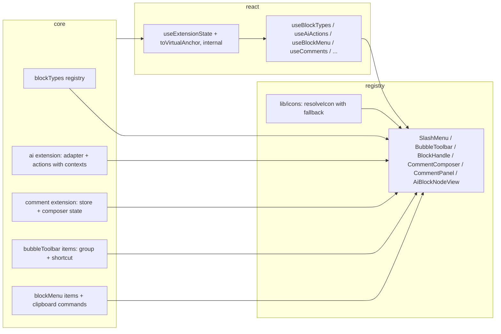

# UI Consistency — Design Brief

Accepted design for making every editor surface (slash menu, bubble toolbar, block menu, Ask AI,
comments) follow the one pattern the slash/mention/link surfaces already use: **core computes,
react coordinates, registry renders.** Breaking change to `@slash-editor/core` and
`@slash-editor/react` (minor bump, changeset, clean cutover — no shims).

## Foundation

### Problem

An architecture review found three competing conventions:

| Surface                               | How it gets data/capabilities                                                   |
| ------------------------------------- | ------------------------------------------------------------------------------- |
| Slash menu, mention menu, link editor | Core-owned state → `use*` hook → registry component (the target pattern)        |
| Bubble toolbar, block handle menu     | Hand-coded block-type lists, a fake inline `StreamAdapter`, a random `threadId` |
| Comments                              | Store only reachable through `useComments(editor, { store })`                   |

Concrete defects this causes:

1. Block menu "Ask AI" calls `runAiAction` with no `adapter` (hidden behind `as unknown`), so
   `runAiStream` throws on `adapter.stream` and the block always lands in `status: "error"`.
2. Bubble "Ask AI" builds an echo adapter inline and ignores the host's configured `StreamAdapter`;
   its prompts are hard-coded instead of coming from the configured actions.
3. Bubble "Comment" sets a mark with `crypto.randomUUID()` and never creates a thread — an orphaned
   anchor. `CommentPanel` goes through the store correctly; the two paths disagree.
4. The block-type list exists three times (slash items, bubble `BlockTypeDropdown`, block menu
   "Turn into") with different commands (`toggleHeading` vs `setNode`), different coverage (toggle
   only in one), and different icons (callout: lightbulb vs message-square).
5. Root cause of 1–3: the AI adapter is only closed over by the generated slash items, and the
   comment store only lives in a hook argument. No other surface can reach either.
6. `ui-conventions.md` violations in `bubble-toolbar.tsx`: raw purple colours with `dark:`
   overrides, sizing classes on icons, an `ICONS` map without a fallback, a UI-owned `SHORTCUTS`
   map, and `filter(id === "link")` to place the link button.
7. Editing logic in the registry layer: block-menu clipboard copy/paste and a module-level
   `lastCopiedContent` shared by every editor on the page.
8. Hook/storage shape drift: slash/mention expose storage methods, link editor uses commands, AI has
   no storage or hook, comment store has no change signal (the panel polls via `refresh()`). Five
   hooks repeat the same subscribe/anchor boilerplate and four identical `*Anchor` interfaces.

### Goals

- One core registry per concept; every surface renders from it.
- One registration point per external capability (AI adapter, comment store), stored on the editor.
- One hook shape: `state + anchor + actions`, built on a shared internal helper.
- Ask AI works identically from slash, bubble selection, and block menu, through the host adapter.
- Comments: inline composer popover opened from the bubble toolbar, plus the sidebar list.

**Non-goals:** new block types, a real AI backend, comment threading UI beyond the current
create/resolve/reopen/remove, headless compound components in `react` (rejected: `react` never
contains markup, and it would duplicate the shadcn registry's role).

### Architecture



## Technical details

### Core

```ts
// block-types.ts — new. Single source for slash "blocks" items, bubble "Turn into", block menu "Turn into".
interface BlockType {
  id: string; // "paragraph", "heading-1", …, "toggle", "callout", "code-block"
  title: string;
  group: string; // "Basic blocks" | "Advanced blocks"
  icon: string; // icon key
  shortcut?: string; // markdown input-rule hint, display only
  aliases?: string[];
  keywords?: string[];
  when?: (editor: Editor) => boolean; // schema presence
  isActive: (editor: Editor) => boolean;
  /** Converts the block at `pos` (or the selection's block). Same setNode/wrap semantics everywhere. */
  convert: (ctx: { editor: Editor; pos?: number }) => boolean;
}
const defaultBlockTypes: BlockType[];
function blockTypeSlashItems(types: BlockType[]): SlashItem[]; // deleteRange + convert
function activeBlockType(types: BlockType[], editor: Editor): BlockType | null;
// BlockKitOptions.blockTypes?: BlockType[] (default defaultBlockTypes)
```

`defaultSlashItems` becomes `blockTypeSlashItems(defaultBlockTypes)` plus the insert-only items
(horizontal rule, media, table, columns). Slash item ids and ordering are unchanged.

```ts
// ai-kit.ts — new extension named "ai", registered whenever BlockKitOptions.ai is set,
// independent of the aiBlock node (so `ai: { node: false }` + a host NodeView still works).
type AiScope = "cursor" | "selection" | "block";
interface AiAction {
  // replaces AiSlashAction
  id: string;
  title: string;
  description?: string;
  icon?: string;
  prompt: string;
  contexts: ("slash" | "selection" | "block")[]; // where the action is offered
}
interface AiStorage {
  // editor.storage.ai
  adapter: StreamAdapter;
  actions: AiAction[];
}
interface AiRequest {
  action: string;
  prompt: string;
  context: string;
  scope: AiScope;
}
interface RunAiActionOptions {
  action: string;
  prompt: string;
  scope: AiScope;
  pos?: number; // block scope: the block's position
  adapter?: StreamAdapter; // default editor.storage.ai.adapter; none → command returns false
}
// Context is resolved by scope inside the command (callers stop slicing text themselves):
// cursor = doc text before the caret (capped), selection = selected text, block = block text.
// The aiBlock is inserted AFTER the source block — never over the selection.
// For selection/block scope the source range is recorded and mapped through every transaction
// (plugin state keyed by aiBlock id), so Keep can replace it safely later.
editor.commands.runAiAction(options);
editor.commands.acceptAiAction(id, { mode?: "replace" | "insert" }); // default "insert"
// "replace" deletes the mapped source range and puts the paragraphs there; if the range was
// deleted meanwhile (mapResult.deleted) it falls back to "insert". The aiBlock is removed either way.
function createAiSlashItems(actions: AiAction[]): SlashItem[]; // reads adapter from storage at run time
const defaultAiActions: AiAction[]; // continue-writing (slash), summarize (all), improve-writing,
// fix-spelling-grammar, make-shorter, make-longer (selection, block)
```

```ts
// comment.ts — store moves onto the editor; composer state added.
interface CommentOptions {
  HTMLAttributes: Record<string, unknown>;
  store?: CommentThreadStore; // omit: anchors are readable, create/resolve are unavailable
}
interface CommentThreadStore {
  // existing methods, plus:
  subscribe(listener: () => void): () => void; // required — panels re-list on change, no polling
}
interface CommentState {
  activeThreadIds: string[];
  composer: { open: boolean; getClientRect: (() => DOMRect | null) | null };
}
editor.commands.openCommentComposer(); // non-empty selection + store present, else false
editor.commands.closeCommentComposer();
```

```ts
// bubble-toolbar.ts — items carry their own grouping and display hint.
interface BubbleToolbarItem {
  // existing fields, plus:
  group: string; // separators render between groups, in declaration order
  shortcut?: string; // display only, e.g. "⌘B"
}
// defaultBubbleToolbarItems ids: bold, italic, strike, code (group "format"),
// clear-formatting (group "clear"), link, comment (group "annotate").
// comment.run → openCommentComposer(); comment.when → comment mark + store present.
// "Turn into" and "Ask AI" are not items: they are menus rendered from blockTypes and
// ai actions with context "selection".
```

```ts
// block-menu.ts — new; items for the block handle's context menu, plus clipboard commands.
interface BlockMenuItem {
  id: string;
  title: string;
  icon: string;
  group: string;
  variant?: "default" | "destructive";
  when?: (ctx: { editor: Editor; target: BlockTarget }) => boolean;
  run: (ctx: { editor: Editor; target: BlockTarget }) => void | Promise<void>;
}
const defaultBlockMenuItems: BlockMenuItem[]; // copy, paste-below, duplicate, delete
editor.commands.copyBlock(target); // writes text/html + text/plain; keeps a per-editor fallback buffer in storage
editor.commands.pasteBlockBelow(target); // async clipboard read in the item's run; falls back to the buffer
// Menu composition in the UI: Ask AI submenu (actions with "block") → Turn into (blockTypes) → items.
```

### React

- Internal `useExtensionState(editor, storageKey, fallback)` (subscribe + snapshot) and
  `toVirtualAnchor(getClientRect)`; every existing hook is rebuilt on them.
- One exported `VirtualAnchor` type replaces `SlashMenuAnchor`, `BubbleToolbarAnchor`,
  `MentionMenuAnchor`, `LinkEditorAnchor`, `BlockDragAnchor`.
- New: `useBlockTypes(editor) → { items, active, convert(id, pos?) }`,
  `useAiActions(editor, context) → { actions, available, run(actionId, { pos? }) }`,
  `useBlockMenu(editor) → { items, target, anchor, close }` (menu part split out of `useBlockDrag`).
- `useComments(editor)` drops `options.store`, reads it from storage, subscribes to
  `store.subscribe`, and exposes `threads`, `composer`, `openComposer`, `closeComposer`.
- Delete the empty `packages/react/src/{components,hooks,extensions}` directories.

### Registry

- `registry/lib/icons.tsx` (`registry:lib` item): one `ICONS` map + `resolveIcon(key)` with a
  fallback; every surface depends on it instead of keeping its own map.
- `comment-composer.tsx` (new item): `Popover` anchored to `composer.getClientRect`, `Textarea`,
  submit → `addComment`. Needs real DOM focus (like the link editor), so no `initialFocus={false}`.
- `bubble-toolbar.tsx`: renders items by `group`, `BlockTypeMenu` from `useBlockTypes`,
  `AskAiMenu` from `useAiActions(editor, "selection")`. Removes the colour overrides, icon sizing
  classes, `SHORTCUTS`, the id-based link filter, and the inline adapter.
- `block-handle.tsx`: menu from `useBlockMenu` + `useBlockTypes` + `useAiActions(editor, "block")`;
  no casts, no module-level state.
- `ai-block-node-view.tsx`: "Replace" (when the node has a live source range) and "Insert below".
- `comment-panel.tsx`: reads `threads` from `useComments`; no `refresh()`.
- Consistent imports with `.tsx` extensions, per the rest of the registry.

### Error handling and edge cases

- No `ai` configured → AI items/menus hidden via `when`; `runAiAction` without any adapter returns
  `false` (no fake fallback).
- Selection across several blocks → context is the selected text; aiBlock goes after the last
  selected block. Empty selection → selection-context actions unavailable.
- Source range deleted before Keep → "Replace" falls back to insert.
- Store rejection in the composer → keep the draft, show the error inline; no mark is set.
- Selection already carrying threads → composer still creates a new, overlapping thread
  (`excludes: ""` already allows it).
- Collaboration → the store is per room; `subscribe` is how remote thread changes surface.
- Clipboard read denied → paste falls back to the per-editor buffer, then to an empty paragraph.

## Delivery

1. **Core:** `block-types.ts`, `ai-kit.ts`, comment store/composer, bubble item `group`/`shortcut`,
   `block-menu.ts`. Unit tests: slash items derived from block types keep ids/order; `runAiAction`
   falls back to the storage adapter and returns `false` without one; context per scope; source
   range mapping and replace fallback; composer open/close guards.
2. **React:** internal helpers, `VirtualAnchor`, new hooks, `useComments` rewrite.
3. **Registry:** icons lib, comment composer, bubble toolbar and block handle rewrites, node view
   buttons, `registry.json` (new items, updated `registryDependencies`).
4. **Playwright:** bubble Ask AI streams the `mockStreamAdapter` response; block-menu Ask AI reaches
   `done` (regression for defect 1); Replace vs Insert below; comment from the bubble appears in
   the panel; Turn into produces the same node from the bubble and the block menu.
5. **Docs:** `package-apis.md`, `ui-conventions.md`, `slash-command-flow.md`; changeset (minor)
   for `core` and `react` listing the renames (`AiSlashAction` → `AiAction`,
   `defaultAiSlashActions` → `defaultAiActions`, `*Anchor` → `VirtualAnchor`,
   `useComments` options) and the new required `CommentThreadStore.subscribe`.

**Risks:** consumers who copied the old registry components must re-run `shadcn add`; hosts with a
custom `CommentThreadStore` must add `subscribe`. Source-range tracking adds a plugin whose mapping
must survive collaboration transactions — covered by the Replace e2e run under `?collab=`.
